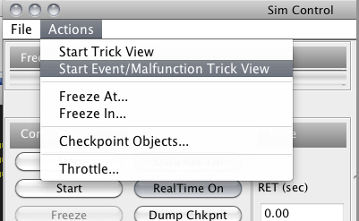
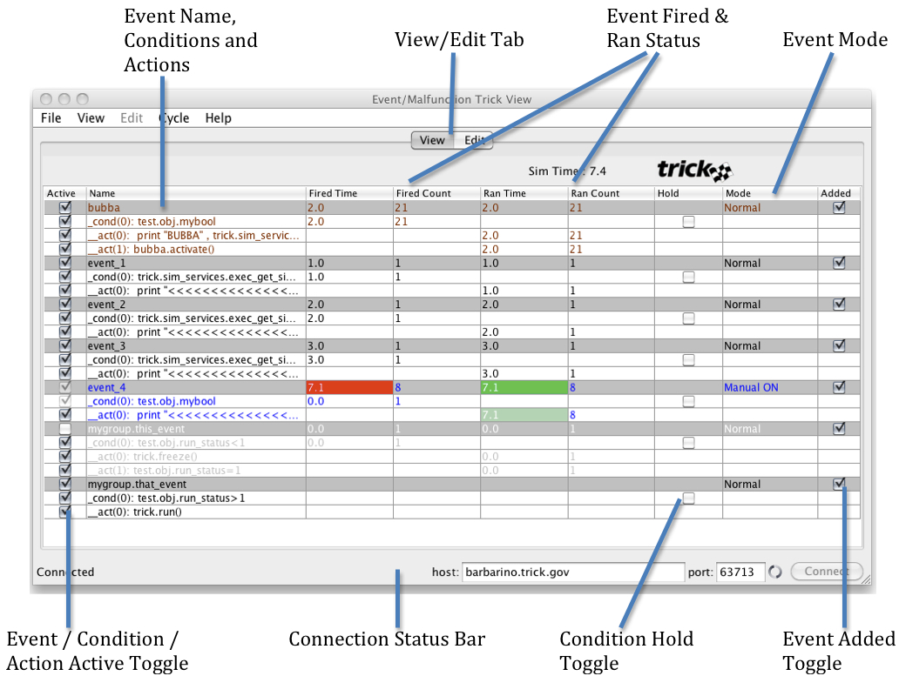
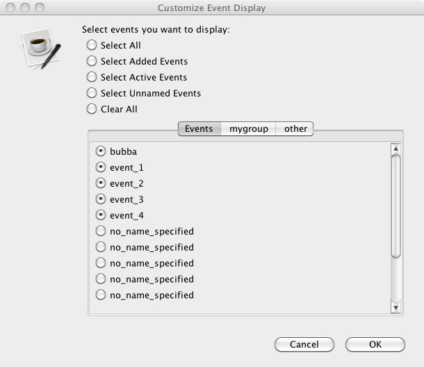
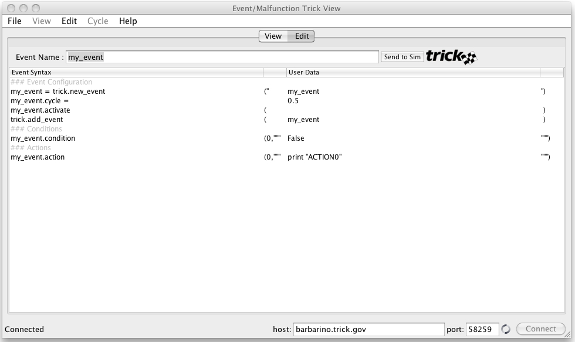

## Events/Malfunctions Trick View
Events/Malfunctions Trick View (hereafter referred to as MTV) is a graphical user interface that has two main functions:

1. to view/control Trick-managed event activity while the simulation is running, and
1. to create/edit Trick-managed events for saving to a file or for sending directly to a running simulation.

"Malfunctions" is a legacy term from when events and malfunctions were separate entities in a previous version of Trick. The functionality of both malfunctions and events have been combined and simply called "Events".

### Launching
Typically MTV is launched via the Actions menu in the @ref SimControlPanel "Simulation Control Panel". MTV will then load and display any events you've defined in your Run input file:



If you want MTV to launch every time you run a simulation, you can automatically launch MTV each run by coding the following in your Run input file:
```
trick.malfunctions_trick_view_set_enabled(1)
```
MTV can also be launched from the command line via:
```
mtv <hostname> <port>
```
The mtv launch script is located in $TRICK_HOME/bin. If you only want to use MTV to create/edit a new event, you can simply type:
```
mtv
```
on the command line in your simulation directory (without the <hostname> or <port> arguments). You can save your newly created event to a file but you of course can't send it to a running simulation in this mode (See @ref MTV_send_to_sim "Send To Sim Button" below).

For additional launching options, see  "Automatically Launching Applications".

### The MTV GUI (in View Mode)
MTV has two main screens, one for viewing events in a running simulation (View Mode), and one for creating / editing events (Edit Mode). The MTV GUI pictured below is in **View** Mode. It may have a different look and feel based on the architecture of the machine on which it is running,
but the functionality will remain the same.



#### View/Edit Tab
Click the "View" Tab to view the events for a running simulation (View Mode). Click the "Edit" Tab to create / edit an event (Edit Mode).

#### Some Background on Event Processing
There is a Trick job called process_event() that is run near the top of the execution frame to evaluate all "Added" events. See @ref Event_Processing "Event Processing" for more details.

#### Event / Condition / Action Active Toggle
The 1st column in View Mode is the Active Toggle.
* Clicking an Active toggle button for an **Event** will make that Event active/inactive in Normal mode.  
* Clicking the Active toggle for a **Condition** will make that Condition active/inactive in Normal mode. 
* Clicking the Active toggle for an **Action** will make that Action active/inactive in both Normal and Manual mode.

#### Event Name, Conditions and Actions
The 2nd column in View Mode is the event name. Each event name is shown on a gray line in the MTV display.
The name is the string that was passed to the `new_event()` command. The event's condition(s) are listed next, followed by the event's action(s). The first 50 characters of each condition/action string are shown, unless the optional comment was passed to the `condition()` or `action()` command. If the comment was specified, it is what will be displayed as the condition or action name. The number in parentheses shown in each condition / action is the index number (from 0..n) used in the `condition()` or `action()` command.

#### Event Fired & Ran Status
Columns 3, 4, 5, and 6 in View Mode show when and how many times the event and its components fired/ran. 
* A **Condition** fires when it is Active in Normal mode and is evaluated as true. 
* An **Event** fires when it is Active in Normal mode and its condition(s) are evaluated as true, or when it is in Manual mode and the command issued is either `manual_fire()` or `manual_on()`. 
* An **Action** runs if it is Active and the event fires. An event runs when at least one of its actions runs.

#### Condition Hold Toggle
The 7th column in View Mode is the Hold toggle, only valid for Conditions. Clicking the Hold toggle on a Condition will turn on/off the Hold status for that condition. If Hold is on, when the condition evaluates to true it will be "held" as true so that the condition will fire each time it is evaluated.

#### Event Mode
The 8th column in View Mode is the Event Mode selector:

1. **Normal** The default, event conditions are evaluated to determine when the event fires (issues a `manual_done()` command).
1. **Manual FIRE** Fire the event once now, remain in manual OFF mode (issues a `manual_fire()` command).
1. **Manual ON** Fire the event every time it is evaluated, remain in manual ON mode (issues a `manual_on()` command).
1. **Manual OFF** Do not fire the event, remain in manual OFF mode (issues a `manual_off()` command).

When in one of the Manual modes, the event's conditions are not evaluated, the manual command issued determines if the event fires.

NOTE: The `manual_fire()` command has the side effect of "restarting" an event's cycle. For instance, if the event cycle is 1.0, in Normal mode it will be evaluated at time 0.0, 1.0, 2.0, etc. However, if you issue a `manual_fire()` command at say, time 2.5, when you return to Normal mode the event will be evaluated at 3.5, 4.5, etc.

#### Event Added Toggle
The 9th column in View Mode is the Event Added Toggle. Clicking an Event's Added toggle will add/remove the event from the list of events that Trick's process_event() job will evaluate.  If an event is not added, then it will not fire cyclically in Normal mode or even in Manual ON mode. However, you can fire an event that has not been added, only one shot at a time by issuing a manual FIRE (`manual_fire()`) command. When you click on the Added toggle to uncheck it, a `remove_event()` command is issued.

NOTE: Instead of adding an event (via `add_event()`) to the list to be evaluated by `process_event()`, you can alternatively add an event before or after a model job with the `add_event_before()` or `add_event_after()` command. When you do this, the event is evaluated immediately before/after that model job (the event cycle is ignored). The initial `add_event_before()` or `add_event_after()` command must be done in the Run input file, but from then on if you click the Added toggle in MTV to remove that event and then click Added to add it later, MTV will remember where it was and will add the event back in the same position before or after the model job you removed it from.

So when you click on the Added Toggle to check it, the event is added using either `add_event()`, `add_event_before()`, or  `add_event_after()`.

#### Colors Used in MTV
1. **Black font** An event in Normal mode that is both Active and Added, having been added using the `add_event()` command.
1. **Brown font** An event in Normal mode that is both Active and Added, having been added using the `add_event_before()` or `add_event_after()` command.
1. **Gray font** An event that is either not Active or not Added, or a condition/action that is not Active (this color overrides the previous two colors).
1. **Blue font** An event in Manual mode (this color overrides the previous three colors, except that actions can be inactive in Manual mode, so inactive actions will be gray).
1. **Red background** An event's Fired Time column is highlighted in red when it fires.
1. **Green background** An event's Ran Time column is highlighted in green when it runs.

#### File Menu
You can select Load Event(s) from the File menu to have Trick read in a file containing one or more events when MTV is connected to a simulation. MTV will then add the newly loaded events to the View Mode window.

#### View Menu
##### Delete Event
If you select an event row in the MTV display, then select Delete Event from the View Menu, you can delete an event permanently from the simulation you are connected to. MTV will remove the event from the display and you can no longer reference that event during the simulation. This will NOT delete any file where the event was loaded from.  The event object itself will be deleted from memory in the running simulation.

##### Customize Event Display
Selecting Customize Event Display from the File Menu will pop up a window where you can select which events you want MTV to display. This is handy when your simulation contains many events and the display window cannot display them all without scrolling. The default is for MTV to display all events contained in the running simulation, up to a maximum of 500. If your simulation has more than 500 events, you must use Customize Event Display to choose a set of 500 or fewer events to display (only the first 500 loaded will initially be shown).

If you have the need to use many events, you may want to create event "groups" by defining your events in the Run input file using Python classes. For instance, the events `mygroup.this_event` and `mygroup.that_event` shown in the MTV GUI picture above were defined like this :

```python
   class MyGroup:
       this_event = trick.new_event("mygroup.this_event")
       this_event.condition(0, "test.obj.run_status<1")
       this_event.action(0, "trick.freeze()")
       this_event.action(1, "test.obj.run_status=1")
       this_event.activate()
       trick.add_event(this_event)
       that_event = trick.new_event("mygroup.that_event")
       that_event.condition(0, "test.obj.run_status>1")
       that_event.action(0, "trick.run()")
       that_event.activate()
       trick.add_event(that_event)
   mygroup = MyGroup()
```

The Customize Event Display popup will recognize such event groups and allow you to select / deselect events by group name. It will contain a Tab for each  event group labeled with the group name; events that do not belong to any group will be in a Tab labeled "Events".



You may notice some events named "no_name_specified". These are either events created for `add_read()` statements in the Run input file, or events created by the `new_event()` command when no name string was passed in. By default MTV does not display unnamed events, but you can display them if you want by selecting them in Customize Event Display.

#### Cycle Menu
The Cycle Menu allows you to set how fast the MTV GUI receives updates from the simulation it is connected to. The default cycle update rate is 0.50, but the Cycle Menu lets you pick from 0.05 (fastest) to 1.0 (slowest).

#### Connection Status Bar
At the bottom of the MTV GUI is the Connection Status Bar. At the far left of the bar is an area where status messages are displayed. It normally says "Connected" or "Disconnected" depending on if MTV is connected to a running simulation. When the MTV GUI display updates the events being displayed (at startup or after you selected Customize Event Display), each event name will be briefly displayed in this status message area while loading.

There are two text fields containing the host name and port number of the connected simulation. When not connected, the user can enter the appropriate host name and port number into these text fields and click the Connect button at the right to connect to a running simulation. (The port number is the Trick variable server port number that can be found on the bottom of the "Simulation Control Panel" if it is up.)

### The MTV GUI (in Edit Mode)
MTV has two main screens, one for viewing events in a running simulation (View Mode), and one for creating / editing events (Edit Mode). The MTV GUI pictured below is in **Edit** Mode.



#### View/Edit Tab
Click the "Edit" Tab to create / edit an event (Edit Mode). Click the "View" Tab to view the events for a running simulation (View Mode).

#### Event Name Text Field
When you first bring up the Edit Mode screen in MTV, the Event Name string is set to "put_new_event_name_here". You must enter a new Event Name string here before you can begin to edit the event.  Note that you must press the "Enter" key on your keyboard to register the new Event Name and enable the "Event Syntax" and "User Data" areas.

#### Event Syntax Area
Once you've entered an Event Name, MTV will automatically generate a default set of commands to configure your new event. The part of the commands shown under the Event Syntax column on the left is not editable. You can add or delete commands using the "Edit Menu" described below.

#### User Data Area
The part of the event commands shown under the User Data column on the right is editable. You can double click the User Data text you want to change and enter in whatever you want. Note that there is no means of checking your syntax, so if you enter incorrect syntax, you won't find out until you send the event to your simulation and it is evaluated by Trick during execution. A Python syntax error in your event will be printed to the screen and looks something like this:
```
File "<string>", line 1
  trick_ip.ip.return_val = XXX
SyntaxError: unexpected EOF while parsing
```

Where "XXX" is the offending string from your event command.

#### Send To Sim Button
When you have created and edited an event to your satisfaction, you can click the Send To Sim button to the right of the Event Name to send the new event to a connected simulation. Trick will read in the new event and it will be displayed in the MTV View Mode window.

#### File Menu
You can select Save Event from the File Menu if you want to save your newly created event to a file. If you don't do this, it will be lost once you quit MTV or when your connected simulation terminates.

Currently there is no way to Load Event(s) from a file into the MTV editor. It is strictly for creating new events from scratch.

#### Edit Menu
##### Create New Event
If you select Create New Event from the Edit Menu, any editing you've done that is currently displayed under Event Syntax and User Data will be discarded, and the Event Name will be set to "put_new_event_name_here" where you must enter a new Event Name string to continue.

##### Delete Line
If you select an event statement shown under Event Syntax / User Data, then select Delete Line from the Edit Menu, that line will be deleted from the event you are editing.

##### Add Line to condition/action
You can add more line(s) to a condition or action by first selecting a condition or action statement under Event Syntax / User Data, then select Add Line to condition/action from the Edit Menu.

##### Add Statement
You can add more event commands to the event you are editing by selecting Add Statement from the Edit Menu.  A selection of common valid event commands are then popped up for you to select.  Some advanced Trick commands, such as trick.remove_event(), can only be added manually after you have "stubbed-out" a new event via MTV.
