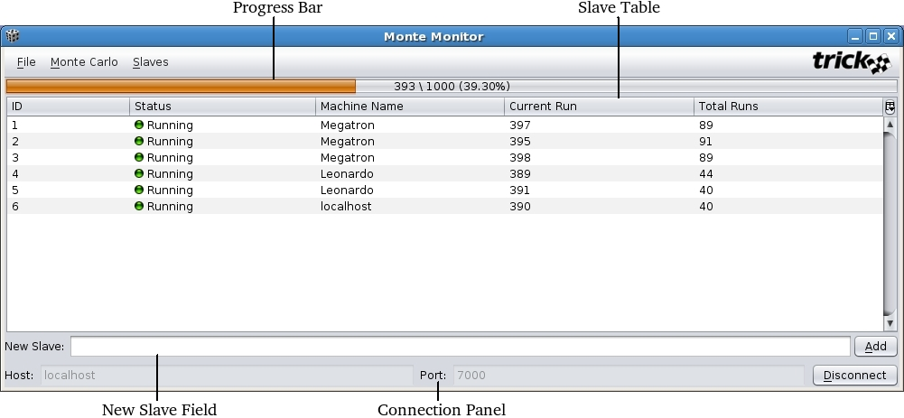

## Monte Monitor

Monte Monitor (hereafter referred to as MM) is a graphical user interface that allows users to view and modify the states
of slaves in a Monte Carlo simulation.

### Launching

MM can be launched from the command line via:

'''
${TRICK_HOME}/bin/mm [options]
'''

Pass <code>--help</code> for a description of available options. For additional launching options, see
"Automatically Launching Applications".

### The GUI

The GUI pictured below may have a different look and feel based on the architecture of the machine on which it is running,
but the functionality will remain the same.

#### Progress Bar

The progress bar displays a visual and textual representation of how far the Monte Carlo has progressed. The format is
<code>\<resolved runs\> / \<total runs\> (\<percent resolved\>)</code>.

#### Slave Table

The slave table displays information on each of the slaves. From left to right, this information is:

<ul><li><b>ID</b> 
  The unique ID of the slave.

<li><b>Status</b> 
  The current status of the slave. It can be one of:

  <ul><li><b>Unitialized</b> 
    The slave has yet to be spawned.

  <li><b>Initializing</b> 
    The slave has been spawned, and the master is waiting for initialization information from it. Once initialized, the
    slave will be in the <code>Ready</code> state. Since Monte Carlo cannot determine if slaves spawn correctly, slaves
    that fail to spawn will remain in this state for the duration of the Monte Carlo.

  <li><b>Ready</b> 
    The slave is awaiting a dispatch.

  <li><b>Running</b> 
    The slave is processing a run. Once completed, the slave will be in the <code>Ready</code> state.

  <li><b>Stopping</b> 
    The slave is processing a run. Once completed, the slave will be in the <code>Stopped</code> state.

  <li><b>Stopped</b> 
    The slave is not accepting dispatches.
  <li><b>Finished</b> 
    No runs remain to dispatch to the slave.

  <li><b>Unresponsive - Running</b> 
    The slave has timed out and is also in the <code>Running</code> state.

  <li><b>Unresponsive - Stopping</b> 
    The slave has timed out and is also in the <code>Stopping</code> state.

  <li><b>Disconnected</b> 
    The connection to the slave has been lost.

  <li><b>Unknown</b> 
    MM could not interpret the state of the slave as reported by the Monte Carlo simulation.

</ul>

<li><b>Machine Name</b> 
  The name of the machine on which the slave is running.

<li><b>Current Run</b> 
  The ID of the run the slave is currently processing.

<li><b>Total Runs</b> 
  The number of runs the slave has completed.
</ul>

#### New Slave Field

The new slave field allows the user to add a new slave by machine name while the Monte Carlo is running. Note that slaves
that fail to spawn for any reason (a bad machine name, for instance) will nevertheless appear in the slave table with a
status of <code>Initializing</code>.

#### Connection Panel

The connection panel displays host and port information when MM is connected to a simulation, and allows the user to
specify these parameters when disconnected.

### Starting and Stopping

Slaves can be started and stopped while the Monte Carlo is running via the <code>Monte Carlo</code> and
<code>Slaves</code> menus. Selecting a command from the <code>Monte Carlo</code> menu is equivalent to applying the same
command from the <code>Slaves</code> menu to all slaves in the slave table. Stopping a slave will prevent any further
runs from being dispatched to it after its current dispatch completes. Starting a slave will resume dispatches to it.

