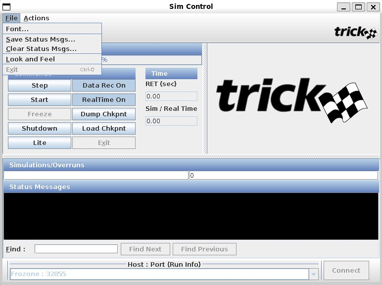

| [Home](/trick) → [Documentation Home](../../Documentation-Home) → [Running a Simulation](../Running-a-Simulation) → [Runtime GUIs](Runtime-GUIs) → Simulation Control Panel |
|------------------------------------------------------------------|

## Simulation Control Panel

The Simulation Control Panel, also known as the Sim Control Panel, is a graphical user interface that allows users to control and view the state of a simulation.

### Launching

The Panel can be launched in a few ways:

- Via the command line `trick-simcontrol [host name] [port number]`

- Using the input file to launch it automatically, see [Automatically Launching Applications](Runtime-GUIs#automatically-launching-applications).

### The GUI

The GUI pictured below may have a different look and feel based on the architecture of the machine on which it is running, but the functionality will remain the same.

#### File Menu

The File menu pictured below contains operations to manage the Sim Control Panel's status messages as well as its look and feel.

- **Font:** Opens a dialogue to customize the font of the status message pane

- **Save Status Messages:** Opens a file chooser that allows you to save the current status messages to a specific file.

- **Clear Status Message Log:** Clears any messages within the status message pane

- **Look and Feel:** Changes the theme and color palette of the Sim Control Panel

- **Exit:** Exits the application

#### Actions Menu

The following picture is of the Action menu that  

#### Toolbar

##### Start TV

##### Start MTV

##### Throttle

#### Command Panel

#### Misc