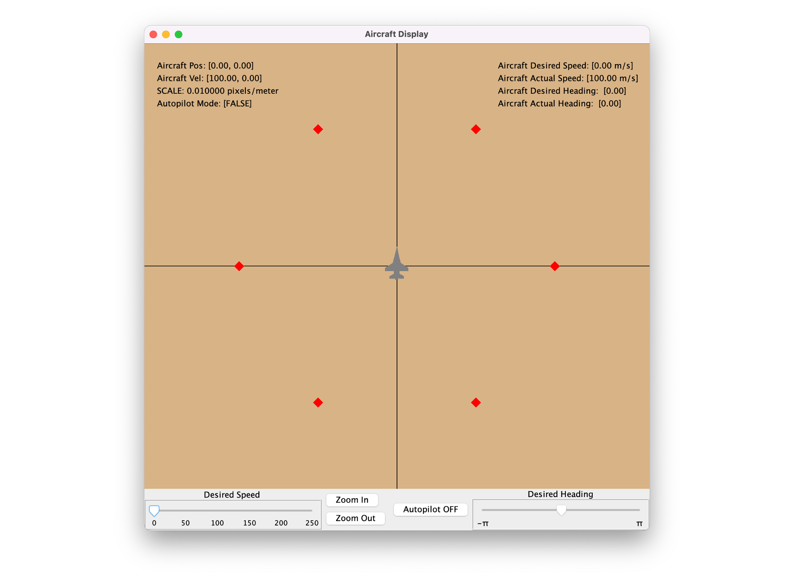
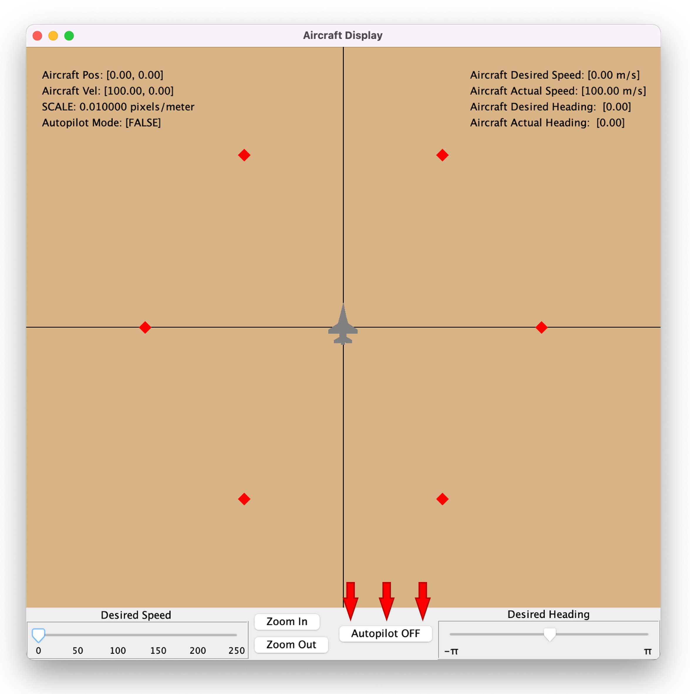
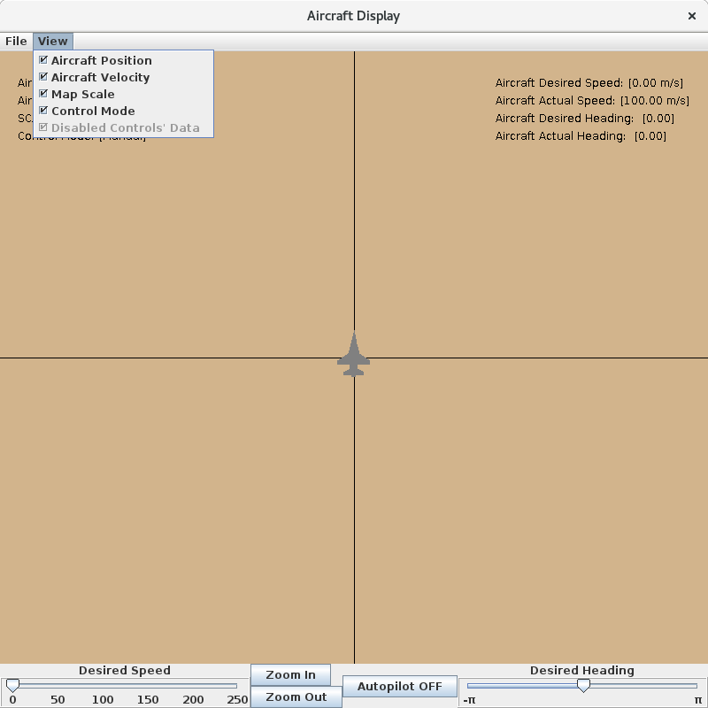
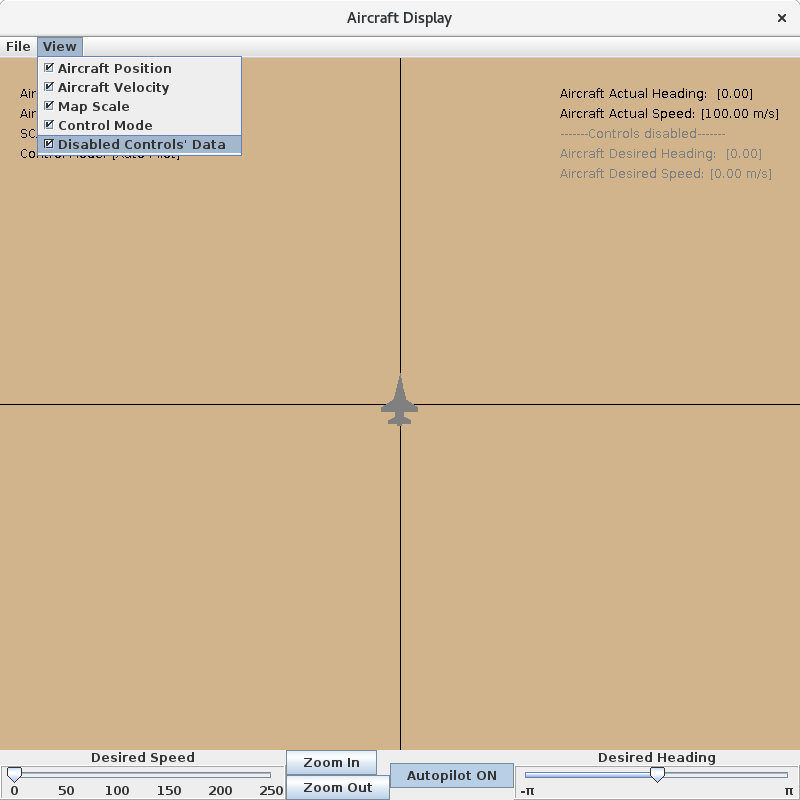
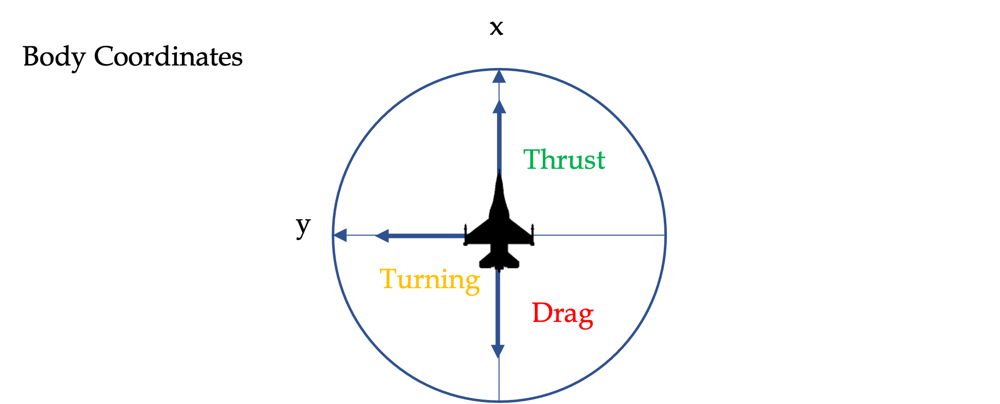
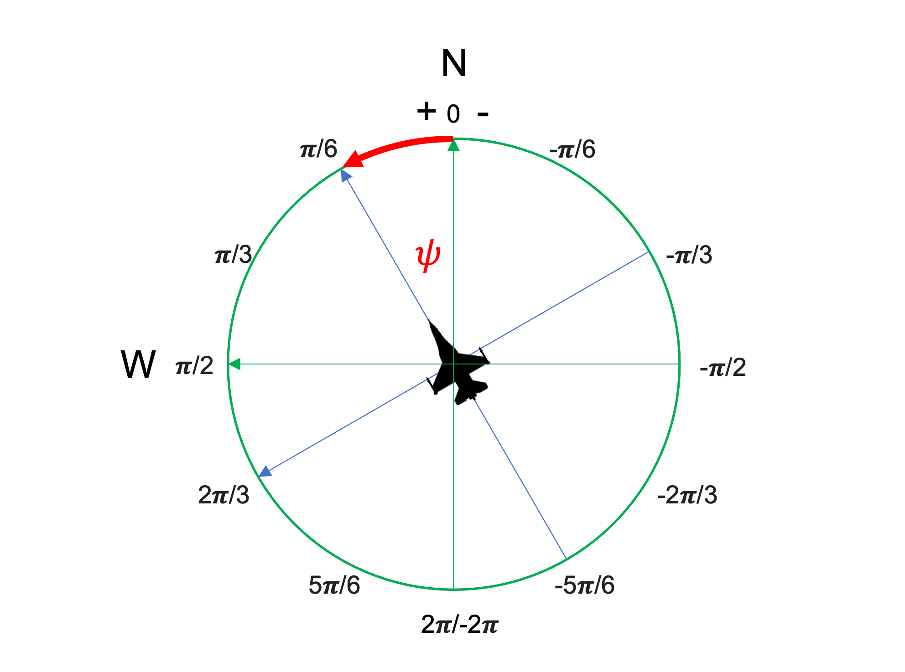
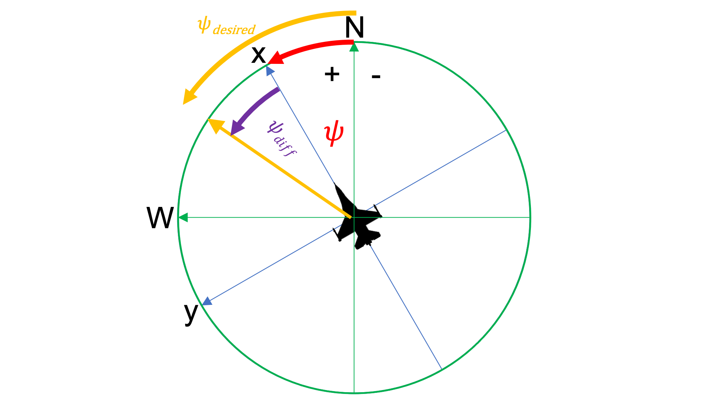

# Aircraft Simulation

SIM_aircraft is a 2-dimensional aircraft simulation. It uses the forces of engine thrust, and aerodynamic drag, and a turning force, as described in the following pages to compute the position and velocity of an aircraft.

### Simplifications

The simulated aircraft moves on a map, but not in altitude. 

In this simulation, we’ll assume that the aircraft always points in the direction of flight. In the aircraft body coordinates, thrust is directed in the +x direction and drag in the –x direction.

Control
In this simulation, we can manually control the aircraft by specifying:
1) a desired speed
2) a desired heading.

or automatically.

## Building the Simulation
In the ```SIM_aircraft``` directory, type **```trick-CP```** to build the simulation executable. When it's complete, you should see:

```
=== Simulation make complete ===
```
Now **cd** into ```models/graphics/``` and type **make**. This builds the graphics client for the simulation.

## Running the Simulation
In the SIM_aircraft directory:

```
% S_main_*.exe RUN_test/input.py
```
The Sim Control Panel, and a graphics client called "Aircraft Display" should appear.

Click Start on the Trick Sim Control Panel.



### Manual Control of the Aircraft
The two sliders on the bottom left and right are for setting the aircraft's desired speed and heading, respectively. The desired speed can range from 0 to 250 meters per second. The desired heading is measured in radians, from - $\pi$ to $\pi$.

### Aircraft Autopilot
The autopilot feature is toggled on and off by the ```Autopilot OFF/ON``` button at the bottom of the graphics client. 



When active, the aircraft's heading is automatically calculated to approach a series of waypoints. These waypoints are marked on the map by the image provided in the input file.

#### Adding Waypoints with an Input File
Waypoints can be added to the simulation using an input file specified in `input.py`. 


When the simulation starts they are read into the simulation from the specified file. Currently that file is `default.waypoints`  within the `Modified_data` folder. 

#### Sample Input in [`default.waypoints`](Modified\_data/default.wps):

         0.0,  25000.0,images/wp0.png
     21650.0,  12500.0,images/wp1.png
     21650.0, -12500.0,images/wp2.png
         0.0, -25000.0,images/wp3.png
    -21650.0, -12500.0,images/wp4.png
    -21650.0,  12500.0,images/wp5.png
Each line should have three pieces of data, separated by commas. The first two are the coordinates. They are formatted like GPS coordinates, with the first number being the vertical distance, or 'North', and the second being the horizontal, or 'West', distance. The third part of the line is the path to the image that will be used as the waypoint marker.

### Graphics Client Menu

#### File

The `File` menu allows the user to open a waypoint input file, save the current waypoint list to a new file, or clear the existing waypoint list.


#### View

The `View` menu on the menu bar allows the user to choose the information displayed by the client.



##### Aircraft Position
This checkbox toggles the visibility of the `Aircraft Pos:` field in the top left corner of the map.

##### Aircraft Velocity
This checkbox toggles the visibility of the `Aircraft Vel:` field in the top left corner of the map.

##### Map Scale
This checkbox toggles the visibility of the `Scale:` field in the top left corner of the map.

##### Control Mode
This checkbox toggles the visibility of the `Control Mode:` field in the top left corner of the map.

##### Disabled Controls' Data
This checkbox is disabled unless Autopilot is engaged. When used, it toggles the visibility of the data from the disabled controls in the top right corner of the map.



## Dynamics Model

### General Strategy for Motion
To determine the motion of an object we generally start with Newton’s Second Law: $F = ma$ That is, force equals mass times acceleration.
This allows us to determine the rates that effect motion, that is: acceleration and velocity. Solving for acceleration, we get : $a = F/m$. 

This is the form of Newton’s Law that we generally use.
So, if we have a force acting on a mass, we can determine its acceleration. Then, we can then numerically integrate that acceleration to get velocity and then integrate the velocity to get position.

### Total Force and Acceleration

To calculate acceleration, we’ll use Newton’s Second Law as usual. The force is the total force acting on the aircraft.


The total force on our aircraft is the sum of:

* the thrust force produced by the aircraft’s engine and
* the drag force produced by the aircraft pushing through the atmosphere.
* the turning force, dictated by gravity and the desired turning rate.


If we affix a “Body” coordinate system to the aircraft as shown, then the thrust force will act in the +x direction, and the drag force in the –x direction. That is, thrust and drag that point in opposite directions.



### Drag Force

The magnitude of the drag force is proportional to the square of the aircraft’s speed. We’ll call our constant of proportionality $K_{drag}$ .


By “speed”, we mean the magnitude of the velocity :


### Thrust Force 

The magnitude of the thrust force produced by our engine can be anywhere between 0 and some value that we specify as the maximum ( $thrust_{MAX}$ ). For our aircraft. 

We said in the beginning that we want to control our aircraft by setting a “desired speed”. The amount of thrust produced obviously determines the speed.
So, how much thrust do we need to reach and maintain a desired speed?

* To increase speed, we must accelerate, in which case magnitude of the thrust must be greater than that of the drag.
* To maintain the same speed acceleration must be zero, in which case the thrust and drag magnitudes must be equal.
* To decrease speed, we must decelerate, in which case thrust magnitude must be less than that of drag.

Therefore, the thrust we require to reach and maintain a desired speed must be the same magnitude as the drag force at that desired speed.


If our engine can produce the desired thrust, then we can set the throttle to produce that thrust ( $thrust_{actual}$ ) and we’ll speed up to that speed. But what if we can’t? The most thrust we can produce is $thrust_{MAX}$ , when we’re at full throttle.
So, we must limit $thrust_{actual}$ to that which our engine can actually produce :


So, the magnitude of the thrust force vector is $thrust_{actual}$ , and the direction is [1,0] in Body coordinates. 

### Aircraft Heading

If the aircraft is moving directly north, $\psi = 0$ . Directly west is $\pi/2$ . Directly east is $-\pi/2$ .



### Heading Control

To control our heading, we’d like to calculate a heading rate that is proportional to the difference between our current heading and our desired heading. 




Notice (in the figure) that $\psi_{diff}$ is in the direction that we want to turn. But, what if ( $\left| \psi_{diff} \right| > \pi$ )? That is, it’s greater than 180 degrees?

Do you ever have to turn more than 𝜋 radians (180 degrees) to face any direction? No, you don’t.

Let’s now define $\pis_{error}$ as the actual direction of turning.


This is how we will calculate our desired heading rate:


That is, our desired heading rate is proportional to the amount and direction that we need to turn.

$G_{\psi}$ is a proportionality constant.

### Turning Force

The turning force we needed to turn the desired rate is :


Like our desired speed, just we want something doesn’t mean that the aircraft is capable of it. In our case we need to limit the magnitude of our force to 1 G ( force of gravity), that is 9.8 m/s2 * m. So if our mass is 5000 kg, we need to limit our turning force to between -49000 .. 49000 Newtons.

But we need that total force in world coordinates so we can move our aircraft around in the world.
So, if our heading of our aircraft is 𝜓, what is our direction vector expressed in world coordinates? 

