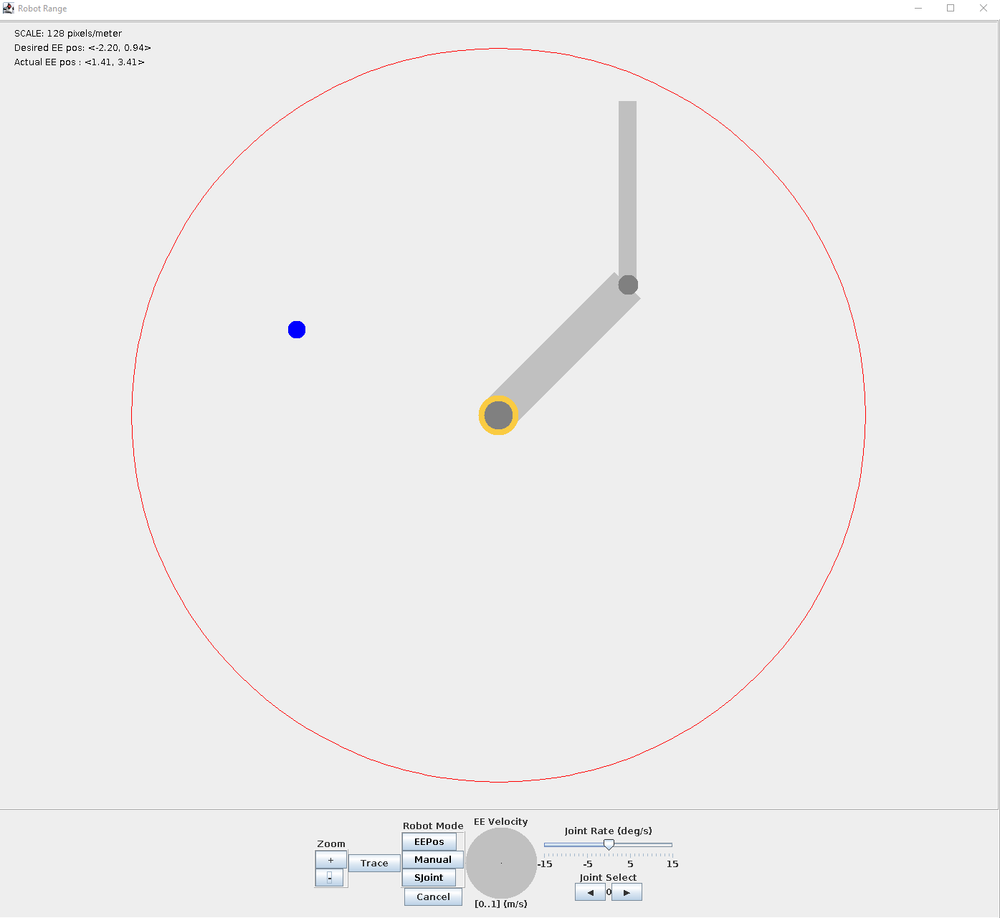

# Planar Robotic Manipulator Simulation

SIM_robot is a 2-dimensional planar robotic simulation of a 2 degree of freedom manipulator.  It is a kinematic simulation, which means that it concerns itself solely with the position and velocity of the links but does not model or account for forces and torques.  This helps keep the simulation more simple and easier to comprehend, while also providing the necessary framework to serve as an adequate example of the general layout of a robotics simulation.  The controller described below and implemented in the simulation is both simple and extremely common.  It is used extensively in both kinematic and dynamic robotic modeling and control.

The simulation calculates both forward and inverse kinematics and implements some common control schemes to allow the user to control the manipulator in a variety of ways.  Only the tip (or end-effector) position of the manipulator is controlled, not the orientation of the last link.

Included is a graphics and user interface client which allows the user to view the motion of the robotic arm in the sim and to send moding and control inputs to the manipulator in real time.  A circle indicates the maximum extent of the workspace of the manipulator.


## Building the Simulation
In order to build a Trick simulation, the Trick-specific command trick-CP must be run to begin compilation process.  trick-CP is located in the Trick **```bin```** directory.  Simply run the trick-CP command in the SIM_robot directory.  Upon successful compilation, the following message will be displayed in the terminal:

```
=== Simulation make complete ===
```

The assocated graphics/user interface client should also be built automatically.

## Running the Simulation
In the SIM_robot directory:

```
% S_main_*.exe RUN_test/input.py
```
The Sim Control Panel, and a graphics client called "Robot Range" should appear.

The sim will come up in Freeze mode.  Click Start on the Trick Sim Control Panel and the simulation time should start advancing.




## Control Modes

There are three control modes available for this manipulator:  Single, Manual, and EEPos.  Each will be described below.  Furthermore, the gui provides a toggle to enable tracing the end-effector position.

### Single Joint Mode
Single Joint Mode is the most straightfoward control mode in the simulation.  It simply commands a selected joint to move with the angular velocity commanded.  The user interface provides a button to select Single as your mode, a Joint select button to choose the desired joint, and a slider to command a desired joint velocity.

### Manual Mode
Manual Mode enables control of the motion of the end-effector with a desired velocity.  This mode commands the end-effector to move in the desired direction at the desired rate until either the velocity command is changed or the arm reaches a singularity (described below).  The gui has an "EE Velocity" interface for interacting in this mode.  The gray circle is like a dial, where the angle and location of the selected point in the circle determine the commanded direction and rate of the end-effector.  For example, clicking directly underneath the center of the circle on the edge will command the end-effector to move straight down as fast as the mode allows.  This input can be changed while moving, allowing the user to maneuver the end-effector however they see fit in real time.

### End-Effector Position Mode
This mode commands the end-effector to autonomously move to the selected point in the workspace.  The user clicks anywhere on the gui display and the end-effector will attempt to move to that location.  Singularities and reach limits may prevent it from reaching the point, however.  The manipulator makes no effort to avoid these.

## Kinematics of the System
The kinematics of a robotic manipulator describe both the position and velocity of the manipulator at any point on the robot.  Kinematics do not include accelerations, forces, or moments in their description.

In this sim, we will discuss both forward and inverse kinematics.  Forward kinematics give the position/velocity of any location of interest on the manipulator given a set of joint angles/velocities.  Inverse kinematics go in the reverse:  Given a desired location/velocity for some point of interest on the manipulator, the equations supply the necessary joint angles/velocities.

The position of the end-effector is highly non-linear and heavily coupled with respect to the joint angles required to produce said position.  However, the velocity of the end-effector is linearly related to the joint velocities required to produce it, which forms the basis of the controller described below.  The non-linearity of the position equations, and the linearity of the velocity equations, will be shown in the next sections.

### How to Layout Points, Frames, and Joint Angles
The position of the end-effector relative to some fixed Base frame location can be calculated by knowing the joint angles of the manipulator and the lengths of the manipulator links.  First we will assign some points of interest along the manipulator that need to be kept track of during the forward kinematics calcualtions.  We will define the point around which the first link's rotation is centered as point A, the point of the second link's rotation B, and the tip of the manipulator (our end-effector) as E.  The distance between A and B will be defined $L1$ and between B and E $L2$.


But points of interest are of no use without frames of reference, so we need to define some frames in which we can define the relative locations of these points.  Let's define a fixed, static Base (or Origin) Frame Fa centered on point A.  This frame will give us a reference frame to keep track of the location of points A and B (point A won't move, and point B moves by changing the first joint angle).  However, point E moves if either joint moves.  We need to keep track of how the links change their orientation with respect to both the base frame and to each other.  To do this we assign frames attached to each link, that move along with it, called Fb.  The convention for this sim is to point the X-axis of each frame along the length of these straight links, so that the X-axis points from each point of interest to the next (A to B, B to E).  Finally we will attache a frame to the end-effector, Fe.`


We also need to keep track of the joint angles, since they can and will change during the run (otherwise it's less a manipulator and more a sculpture).  Let's define the joint angles as $q1$ and $q2$, making 0 rotation align all three frames so that they are all oriented the same way.  This way any rotation of a link can be easily described with joint angles q1 and q2.


Now everything of importance to the kinematics of the system has been identified.  The base and joint frames allow us to keep track of the relative location of the points on the manipulator with respect to each other and the base, fixed inertial reference frame.  The joint angles allow us to describe every possible location of each of the points in any frame.

### Frame Rotations
Given that a robot will have at least as many frames as it has links, we need to be able to transform the information about the manipulator from one frame to another.  This is called frame rotation.  One can construct a *rotation matrix* if the relative orientation of any two frames is known with respect to each other.  In this example, we will be rotating between frames Fa, Fb, and Fe (specifically, from Fb back to Fa to express everything in Fa).  

In general, if you have two frames, A and B, rotated with respect to each other by an angle $q$, then you can determine how the unit vectors which make up frame B relate to frame A:


Unit vectors, such as $\hat{X}_a$ and $\hat{Y}_a$, are by definition length 1.  The cosine of the angle q is defined as the length of the adjacent side divided by the hypotenuse.  Since the length of the hypotenuse has to be 1, $cos(q)$ is equal to the length of the adjacent side.  For $sin(q)$, you use the opposite side instead of the adjacent.


Given the information above, $X_B$ and $Y_B$ can be described with respect to frame A as:


These equations together can be written in matrix form as


This matrix is called a rotation matrix, from Frame A to Frame B, commonly denoted as


This is the rotation matrix from Frame A to Frame B.  If you take any vector described in frame A and pre-multiply it by this rotation matrix, you will get the same vector but expressed in frame B.  More often than not, you will actually be more concerned with rotation from Frame B back to Frame A.  To do this, you would need the inverse of the matrix (which reverses the frame transformation order).  Luckily, rotations matrices are *orthonormal*, and one characteristic of matrices like this is that the inverse of this matrix is equal to the transpose (which is much easier to find in general).


This is the bread and butter of kinematics, so you will definitely see this again.


### Position of the End-Effector
The position of the tip of manipulator can be described by calculating the vectors from points A to B and from B to E and adding them together.  Vectors can be added together if they are described in the same frame.  Vectors are simply lengths in a particular direction.

The vector from points A to B is a function of the joint angle $q1$ and the length of the link $L1$ (described in the base frame Fa).  The vector from points B to E is a function of the joint angle $q2$ and the length of the link $L2$ (described in the first link's frame Fb).


As can be seen in the figure above, the $x$ and $y$ components of the vector which goes from Point A to Point B is shown to be


expressed in the base frame Fa.

The $x$ and $y$ components of the vector from B to E is shown to be


expressed in the first link's frame, Fb.  However, we can't add a vector in frame Fa to one in frame Fb.  They have to be in the same frame.  


### Velocity of the End-Effector

### The Jacobian

### Singularities


## Control Schemes

### Single Joint Mode

### Manual Mode

### End-Effector Position Mode

### Singularity Management


