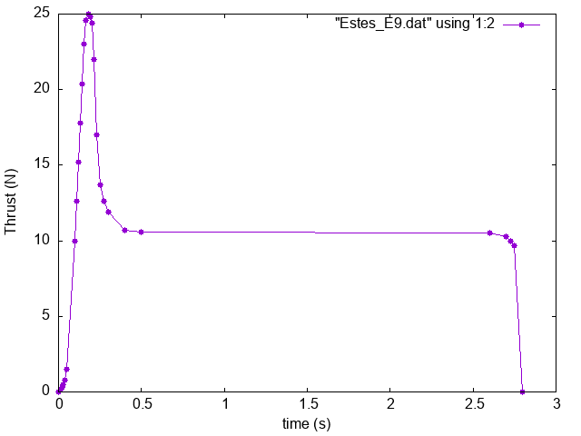
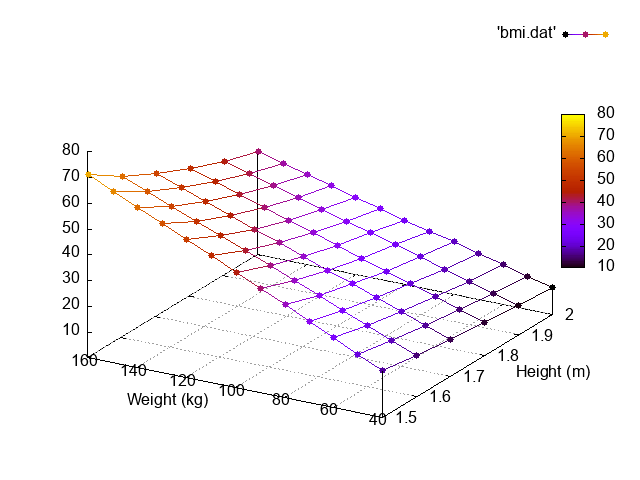

# Trick::Interpolator

The Trick::Interpolator class provides a means of estimating the values of a function within a set of points sampled from that function.

## Header

```C
#include "trick/Interpolator.hh"
```

## Constructor

```C
Trick::Interpolator (double* Table,
                     double** BreakPointArrays,
                     unsigned int* BreakPointArraySizes,
                     unsigned int NParams)
```

* Table - array of function (output) values. The size of this array is the product of the BreakPointArraySizes.
* BreakPointArrays - an array of pointers to the breakpoint arrays. One breakpoint array per independent variable.
* BreakPointArraySizes - an array of the sizes of each of the breakpoint arrays.
* NParams - number of independent variables.

## Member Function

```
double Trick::Interpolator::eval (double param1, ...)
```
This member function returns an estimate of the function represented by the interpolator.
If the arguments are out side the bounds the interpolator break points, a ```std::logic_error```
exception will be thrown. 

# Examples

---

## One Independent Variable Example

Suppose we have a set of points that represent the thrust vs. time function of an Estes E9 model rocket engine as shown below, and we want to be able to estimate the thrust for times anywhere between the minimum and maximum sample times.



Since these points represent thrust as a function of time, time is the independent variable. 
The values of the independent variable where points have been sampled are called **breakpoints**.

### Setting Up Data for the Interpolator


```
/* Number of independent Variables. [Constructor Arg#4] */
#define E9_INDEPENDENT_VAR_COUNT 1

/* Number of elements in the breakpoint array */
#define E9_BP_SIZE 28

/* The one Breakpoint array */
double E9_sample_times[E9_BP_SIZE] = {
0.000, 0.010, 0.020, 0.030, 0.040, 0.050, 0.100, 0.110, 0.120, 0.130,
0.140, 0.155, 0.165, 0.180, 0.190, 0.200, 0.215, 0.230, 0.250, 0.275,
0.300, 0.400, 0.500, 2.600, 2.700, 2.725, 2.750, 2.800 };

/* Thrust values at the breakpoints. [Constructor Arg #1] */
double E9_thrust_array[E9_BP_SIZE] = {
 0.0,  0.1,  0.3,  0.5,  0.8,  1.5, 10.0, 12.6, 15.2, 17.8,
20.4, 23.0, 24.6, 25.0, 24.8, 24.4, 22.0, 17.0, 13.7, 12.6,
11.9, 10.7, 10.6, 10.5, 10.3, 10.0,  9.7, 0.0 };

/* BreakPointArrays. [Constructor Arg#2] */
double* break_point_arrays[E9_INDEPENDENT_VAR_COUNT] = { E9_sample_times };

/* BreakPointArraySizes. [Constructor Arg #3] */
unsigned int break_point_array_sizes[E9_INDEPENDENT_VAR_COUNT] = { E9_BP_SIZE };
```

### Constructing the Interpolator
Using the data structures from above, we can construct an interpolator.

```
Trick::Interpolator* motor_thrust_interpolator =
    new Trick::Interpolator( E9_thrust_array,
                             break_point_arrays,
                             break_point_array_sizes,
                             E9_INDEPENDENT_VAR_COUNT);
```

### Using the Interpolator
To use the interpolator, we simply call the **```eval()```** member function as follows, assuming that ```time``` and ```thrust``` are of type ```double```.

```
    try {
        thrust = motor_thrust_interpolator->eval( time );
    } catch (std::logic_error e) {
        thrust = 0.0;
    }
```

---

## Two Independent Variable Example

Suppose we have a table of body-mass-index (BMI) values that have been sampled at each of the heights and weights as shown below, and that we want to estimate BMI between where the samples were measured. For example: What's the BMI for 1.82 meters, and 67 kg?



In this situation we have two independent variables. Therefore we have two breakpoint arrays, one for weight, and one for height. The size of the weight, and weight breakpoint sets (arrays) are 13, and 6 respectively.

```
/* Number of independent Variables. [Constructor Arg#4] */
#define BMI_INDEPENDENT_VAR_COUNT 2

/* Number of elements in the weight breakpoint array */
#define WEIGHT_BP_SIZE 13

/* Number of elements in the height breakpoint array */
#define HEIGHT_BP_SIZE 6

/* ---------------------------------------------------------------------------------*/
/* NOTICE that we've coverted kg to lb, and m to inches in the breakpoint arrays.   */
/* This just demonstrates a units conversion trick in breakpoint arrays.            */
/* ---------------------------------------------------------------------------------*/

double weight_lb[WEIGHT_BP_SIZE] = { 88.2, 110.25, 132.3, 154.35, 176.4, 198.45,
    220.5, 242.55, 264.65, 286.65, 308.6, 330.75, 352.7 };

double height_inches[HEIGHT_BP_SIZE] = { 59.0, 63.0, 67.0, 71.0, 75.0, 78.0 };

/* BreakPointArrays. [Constructor Arg#2] */
double* bmi_break_point_arrays[BMI_INDEPENDENT_VAR_COUNT] =
    { weight_lb, height_inches };

/* BreakPointArraySizes. [Constructor Arg #3] */
unsigned int bmi_break_point_array_sizes[BMI_INDEPENDENT_VAR_COUNT] =
    { WEIGHT_BP_SIZE, HEIGHT_BP_SIZE};

[Constructor Arg #1]
double bmi_table[] = {
    /*           1.5m    1.6m    1.7m    1.8m    1.9m     2.0m */
    /*       ================================================= */
    /*  40kg */ 17.78,  15.62,  13.84,  12.35,  11.08,   10.00,
    /*  50kg */ 22.22,  19.53,  17.30,  15.43,  13.85,   12.50,
    /*  60kg */ 26.67,  23.44,  20.76,  18.52,  16.62,   15.00,
    /*  70kg */ 31.11,  27.34,  24.22,  21.60,  19.39,   17.50,
    /*  80kg */ 35.56,  31.25,  27.68,  24.69,  22.16,   20.00,
    /*  90kg */ 40.00,  35.16,  31.14,  27.78,  24.93,   22.50,
    /* 100kg */ 44.44,  39.06,  34.60,  30.86,  27.70,   25.00,
    /* 110kg */ 48.89,  42.97,  38.06,  33.95,  30.47,   27.50,
    /* 120kg */ 53.33,  46.87,  41.52,  37.04,  33.24,   30.00,
    /* 130kg */ 57.78,  50.78,  44.98,  40.12,  36.01,   32.50,
    /* 140kg */ 62.22,  54.69,  48.44,  43.21,  38.78,   35.00,
    /* 150kg */ 66.67,  58.59,  51.90,  46.30,  41.55,   37.50,
    /* 160kg */ 71.11,  62.50,  55.36,  49.38,  44.32,   40.00
};
```


### Constructing the Interpolator
Using the data structures from above, we can construct an interpolator.

```
Trick::Interpolator* bmi_interpolator =
    new Trick::Interpolator( bmi_table,
                             bmi_break_point_arrays,
                             bmi_break_point_array_sizes,
                             BMI_INDEPENDENT_VAR_COUNT);
```

### Using the Interpolator
To use the interpolator, we simply call the **```eval()```** member function as follows, assuming that ```time``` and ```thrust``` are of type ```double```.

```
    try {
        bmi = bmi_interpolator->eval( weight, height );
    } catch (std::logic_error e) {
        std::cerr << "Out of bounds." << std::endl;
    }
```


